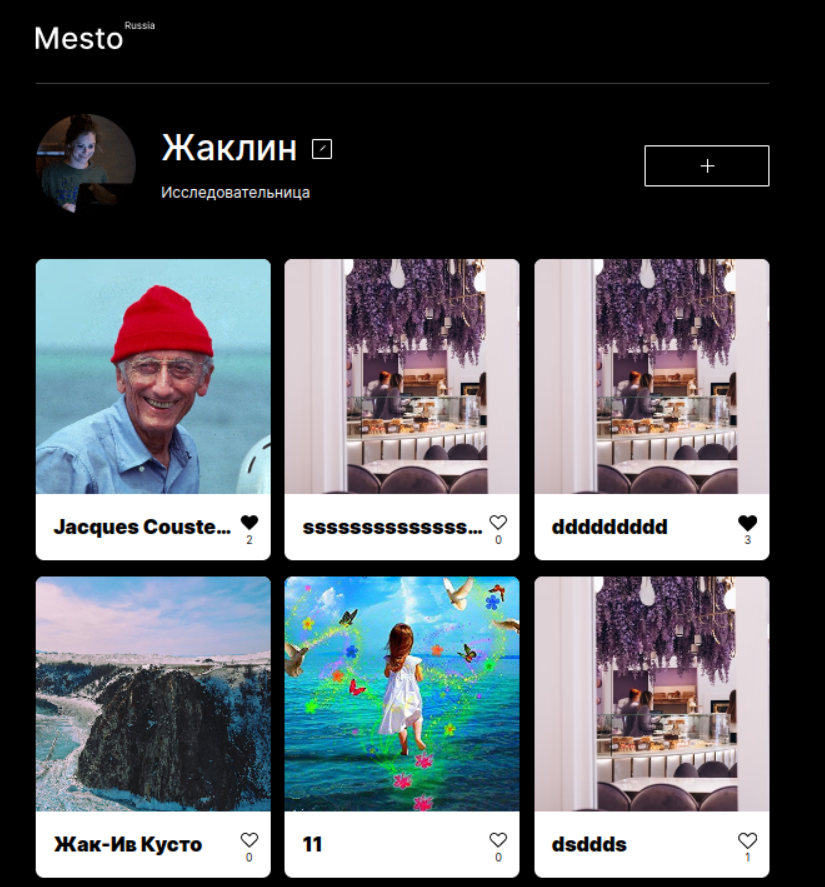

# Сервис Mesto.

## Описание

Приложение на нативном JavaScript по просмотру и редактированию фотографий.

### Основной функционал:

* Добавление / удаление фото
* Лайк / дизлайк фото
* Редактирование профиля
* Просмотр полноразмерного фото



### [Демо](https://vovitolog.github.io/mesto/)
### [Макет](https://www.figma.com/file/2cn9N9jSkmxD84oJik7xL7/JavaScript.-Sprint-4?node-id=0%3A1)

## При реализации использованы:

* Семантическая вёрстка HTML
* CSS:
  * Flexbox
  * Grid
  * Media-запросы
  * Адаптив Desktop-first
* Система контроля версий GIT
* Файловая структура по методологии БЭМ
* JavaScript:
  * Слушатели событий
  * Валидация форм
  * Классы
  * Fetch API
* Сборка Webpack


## Настройка билда Webpack

Установка и запуск:
```
npm install - установка зависимостей
npm run build - сборка проекта
npm run dev - запуск проекта
```
